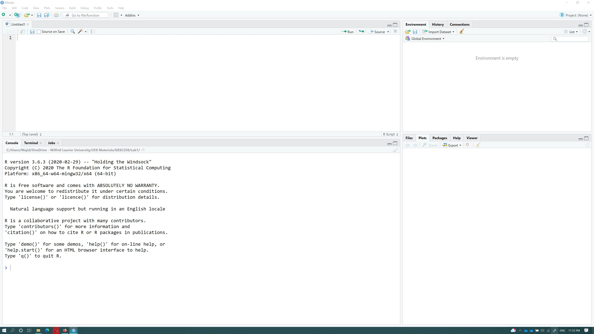

## GESC 258- Geographical Research Methods

**Access online version of this document at (https://rpubs.com/majidhojati/gesc258lab1)**

R-Studio is one of the most widely used software packages in data science, statistics and data analysis more generally. Many employers in the environmental field now greatly value skills in R - so even though the learning curve can be a little steeper, it is well worth the effort to learn this approach to data analysis. 

Attend your first lab session to briefly meet your TA instructor and to get the course software installed on your computer. We will be using an open source software package called R and R-Studio for most of the work in this course.

In this lab you will:   

- Familiarize yourself with the R studio interface   

- Learn the basic of R programing

- Create simple graphs   
 
As a supplement to the lab materials, I highly recommend using `[YaRrr! The Pirate’s Guide to R](https://bookdown.org/ndphillips/YaRrr/)` - which has lots of great information and resources for learning R. You can read `chapter 2` for how to get it installed on your machine. The TA will verify everyone has a working installation of R on their machine in lab.


## Part I: Getting started with R


In order to install and run R/Rstudio you can follow one of these methods.

**1-	Installing R and R/ Studio on your machine**

Please follow the steps explained in the Chapter 2 of YaRrr to install R and R/Studio on your machine. 
https://bookdown.org/ndphillips/YaRrr/installing-base-r-and-rstudio.html

**2-	Using Virtual Remote Desktop Labs **

If you prefer to use R studio on [virtual Remote desktop] (https://students.wlu.ca/services-and-spaces/tech-services/assets/resources/virtual-computer-labs.html) you need to login to your online account and search for RStudio in the `start -> all programs`. 

> "Make sure to setup onedrive on your remote desktop machine to avoid losing your data. Ask your lab instructor if you need help setting onedrive up."

### Working With R Studio

**Credit: This section is based on https://bookdown.org/ndphillips/YaRrr/ **
When you open RStudio, you’ll see the following four windows (also called panes)
 

The main 4 sections are as follows :
 
#### Source - Your notepad for code (Top Left)

The source pane is where you create and edit R Scripts" - your collections of code. When you open RStudio, it will automatically start a new Untitled script. Before you start typing in an untitled R script, you should always save the file under a new file name.

> "NOTE: If you see a “*” is shown beside your filename. It means you have unsaved changes in your source. "

You’ll notice that when you’re typing code in a script in the Source panel, R won’t actually evaluate the code as you type. To have R actually evaluate your code, you need to first `send` the code to the Console.
There are many ways to send your code from the Source to the console. The slowest way is to copy and paste. A faster way is to highlight the code you wish to evaluate and clicking on the `run` button on the top right of the Source. 

#### Console: R’s Heart (Bottom Left)

The console is the heart of R. Here is where R actually evaluates code. At the beginning of the console you’ll see the character . This is a prompt that tells you that R is ready for new code. For example, if you type `1+1` into the console and press enter, you’ll see that R immediately gives an output of 2.
```{r}
1+1
```

> Tip: Try to write most of your code in a document in the Source. Only type directly into the Console to de-bug or do quick analyses.
>
> Tip: If you use # at the beginning of a line in R code it will not get executed. We usually use # at the beginning of lines to write 
comments in the code.


####  Environment / History (Top Right)

The Environment tab of this panel shows you the names of all the data objects (like vectors, variables, and dataframes) that you’ve defined in your current R session. You can also see information like the number of observations and rows in data objects.

####  Files / Plots / Packages / Help (Bottom Right)

The Files / Plots / Packages / Help panel shows you lots of helpful information. Let’s go through each tab in detail:

1.	Files - The files panel gives you access to the file directory on your hard drive. One nice feature of the “Files” panel is that you can use it to set your working directory - once you navigate to a folder you want to read and save files to, click “More” and then “Set As Working Directory.”

2.	Plots - The Plots panel (no big surprise), shows all your plots. There are buttons for opening the plot in a separate window and exporting the plot as a pdf or jpeg (though you can also do this with code using the pdf() or jpeg() functions.) 


> You can use this tab to `Export` plots and save them on your machine. 

3.	Packages - Shows a list of all the R packages installed on your harddrive and indicates whether or not they are currently loaded. Packages that are loaded in the current session are checked while those that are installed but not yet loaded are unchecked. 

4.	Help - Help menu for R functions. You can either type the name of a function in the search window, or use the code to search for a function with the name

```{r eval=FALSE, include=FALSE}
?mean   # How does the mean function work?
?t.test # What about a t-test?
```

## R as a simple calculator
You can simply do arithmetic in R console, for example type the following codes and check their results:
```{r}
100+23
```

The following are the simple mathematic functions can be used in R

-	Exponents: `^` or `**`

-	Multiply: `*`

-	Divide: `/`

-	Add: `+`

-	Subtract: `-`

You can also use other math functions as follows
```{r}
sin(1) + log(3) * exp(1)
```

We can also do comparisons in R:
```{r}
1 == 1  # equality (note two equals signs, read as "is equal to")
```

Type the following commands and see their results
```{r eval=FALSE, include=FALSE}
1 != 2  # inequality (read as "is not equal to")
1 >= -9 # greater than or equal to

```

### Variables and assignment
We can store values in variables using the assignment operator `<-`, like this:

```{r}
x <- 1/40
```
Type the following commands in R console and see the outputs
```{r}
x <- 12
y <- log(x)
x
y
```
then
```{r}
 x <- y #see how R is replacing value of x with y
 y-x

```


\newpage
## Part II: Statistical Analysis in R

In this section, we’ll analyze a dataset called cities. The dataset contains data from `1748` population centers acrous Canada. Run the following lines to load this dataset into R.  

> "Hint: type `?read.csv` into R console to learn how this function works"


```{r cities}
cities <- read.csv("https://raw.githubusercontent.com/am2222/GESC258/master/Lab1/data/canadian_population_centers.csv") #loading dataset into R as a dataframe
```

Once you run above code you will see a new item called `cities` is added to the `environment` panel in the RStudio. A very common data structure is an array. In different domains there are other names for such a type of data used synonymously, such as `matrix` in mathematics, `table` in databases, `spreadsheet`, and `data frame`, which is a fundamental R object. Click on `cities` in the `Environment` tab to open it in a new windows. You can also type the following command in RConsole to get the same result.

```{r eval=FALSE}
View(cities)
```

Explore the data. As you see there are different types of columns in this dataset. Some of the columns are in Text format such as `city` or `province_id`. In R we call this type of columns `characters` or `strings`. Some of the columns are all numerical like `population` which represent population of each region. Scroll down to this table and in the `overall_csi_index` column you will see some of the values are shown as `NA`. It means that the value for this cell is missing. Notice that a missing value is different than a `zero` value. During your calculations, you should alwayse be aware of `NA` values. 
Now, let’s take a look at the first few rows of the dataset using the `head()` function. This function will show you the first few rows of the dataframe.


```{r eval=FALSE}
head(cities) # Look at the first few rows of the data
```

```{r echo=FALSE}
knitr::kable(head(cities))
```

The following command shows the last few rows of a dataframe.
```{r eval=FALSE}
tail(cities)
```
You can look at the names of the columns in the dataset with the names() function

```{r}
# What are the names of the columns?
names(cities)
```

You can access dataframe columns and rows using following methods

```{r eval=FALSE, include=FALSE}
cities$population # this will show the `population` column for all the rows

cities[1,] # this will show the first row of the cities dataframe. The general form is cities[n,] where n<=length(cities)

cities[1,]$population # will give you the population field of the 1st row in your dataframe

cities[1,"population"] #same as above


```


# Measures of Central Tendency

## Mean
There are three main measures of central tendency: the `mean`, `the median`, and `the mode`.
Lets start with `mean`

$$
\bar x = \frac{1}{n}\sum_{i=1}^n x_i
$$

```{r}
c.population <- cities$population # extract populations column and storing it as c.population. dot (.) in c.population does not mean anything
c.population.n <- length(c.population) # get the length of the populations vector, which is the number of observations 
c.population.sum <- sum(c.population) # sum up the populations vector
c.population.xbar <-c.population.sum / c.population.n 
sprintf("The arithmetic mean populations in the canadian cities dataset is: %s", round(c.population.xbar,1))

```
> "Note that we used `length`, `sum` and `round` functions in this code snippet. You can learn about each function by typing `?function` in R console.


Of course there is as well an in-built function called `mean()`.
```{r}
mean(c.population)
c.population.mean <- mean(c.population) #we save mean for future use
```
You can check our result with the output of the `mean` function. 

```{r}
all.equal(mean(c.population),c.population.xbar )
```

## Median
The calculation of the median consists of the following two steps:
1. Rank the data set in increasing order.
2. Find the middle term. The value of this term is the median.

```{r}
median(c.population) # returns the median of the c.population
c.population.median<- median(c.population) # we save median for future use
```
Other usefull function to explore a dataset:

```{r}
c.population.min <- min(c.population) # returns the min value of the c.population
c.population.max <- max(c.population) # returns the max value of the c.population
city_min <- cities[cities$population==c.population.min,] # returns the row that has min population
city_max <- cities[cities$population==c.population.max[1],] # returns the row that has max population in cities dataframe
sprintf("%s has max numper of population and %s has min number of population", city_max$city,city_min$city)

```


## The Mode
In statistics, the mode represents the most common value in a data set. Therefore, the mode is the value that occurs with the highest frequency in a data set (Mann 2012). You can calculate `the mode` of a column using the folowing method

```{r}
uniqv <- unique(c.population) # find all the uniqe values in the c.population 
tabulated <- tabulate(match(c.population, uniqv)) #counts the number of times each integer occurs in c.population
uniqv[which.max(tabulated)] #Find the item which has max number of occerance

```

Lets plot population of canadian cities and their mean value

```{r}
plot(c.population, ylim = c(min(c.population),max(c.population)*1.3)) #plot figure
abline(h = mean(c.population), 
       col='red', 
       lwd = 3) # add horizontal line

abline(h = median(c.population), 
       col='green', 
       lwd = 3) # add horizontal line

legend('topright', 
       legend = c("Median","Arithmetic mean"), 
       col = c("green","red"), 
       lty = "solid") # add legend

```

>"The median is not influenced by outliers. as a result the median is preferred over the mean as a measure of central tendency for data sets that contain outliers."

As you see the outlayers are causing a problem in visualizing our data. 

## Measures of Dispersion
The measures of central tendency, such as the mean, median, and mode, do not reveal the whole picture of the distribution of a data set. Two data sets with the same mean may have completely different spreads(Hartmann, 2018). The measures of central tendency and dispersion taken together give a better picture of a data set than the measures of central tendency alone (Mann 2012).

We will use cCrime Severity Index (CSI) for 2020 in this section. AS you remember there are `NA` values in the `overall_csi_index` field. The principal behind the Crime Severity Index (CSI) is to measure the seriousness of crime reported to the police year to year by Statistics Canada. lets first clean the dataset and remove them. 


```{r}
overall_csi <- cities[!is.na(cities$overall_csi_index),'overall_csi_index'] # we get all the rows that their overall_csi_index is not NA and then save value of overall_csi_index into a new variable named  overall_csi
overall_csi.mean <- mean(overall_csi) # we calculate mean of overall_csi
```


### Ragne
The range as a measure of dispersion is simple to calculate. It is obtained by taking the difference between the largest and the smallest values in a data set.
  
  $$Range=Largest value−Smallest value$$
```{r}
  overall_csi.range <- max(overall_csi) - min(overall_csi)
```
### Standard Deviation
By using the mean and standard deviation, we can find the proportion or percentage of the total observations that fall within a given interval about the mean. 

The `variance` is the the sum of squared deviations from the mean. The variance for population data is denoted by $σ^2$ (read as sigma squared), and the variance calculated for sample data is denoted by $s^2$. Here is the equation to calculate $s^2$

$$s^2 = \frac{\sum_{i=1}^n (x_i-\bar x)^2}{n-1}$$
The `standard deviation` is obtained by taking the square root of the `variance`. Consequently, the standard deviation calculated for population data is denoted by $σ$ and the standard deviation calculated for sample data is denoted by $s$.

$$s = \sqrt{\frac{\sum_{i=1}^n (x_i-\bar x)^2}{n-1}}$$

```{r include=FALSE}
overall_csi.var <- var(overall_csi) #variance
overall_csi.sd <- sd(overall_csi) #standard deviation
# concatenate the vectors and round to 2 digits
overall_csi.stats <- round(cbind(overall_csi.mean, 
                                  overall_csi.var, 
                                  overall_csi.sd,
                                 overall_csi.range),2)

colnames(overall_csi.stats) <- c('mean', 'variance', 'standard deviation','range') # rename column names
overall_csi.stats

```

```{r echo=FALSE}
knitr::kable(overall_csi.stats)
```


### Chebyshev’s Theorem
Chebyshev’s theorem gives a lower bound for the area under a curve between two points that are on opposite sides of the mean and at the same distance from the mean. For any number $k$ greater than 1, at least $1−1/k2$ of the data values lie within $k$ standard deviations of the mean. Let us plot Chebyshev’s theorem and interpret it.

```{r echo=FALSE}
k <- seq(1,4,by = 0.1)
auc <- 1-(1/k^2)
auc.percent <- round(auc*100)
cbind(k,auc.percent)
  plot(k, 
       auc.percent, 
       col = 'blue', 
       pch = 19, 
       xlab = 'k', 
       ylab = 'percent', 
       main = 'Chebyshev\'s theorem' )
```

To put it in words: Let us pick a value for $k: k=2$. This means that at least $ (1-(1/2^2))*100= 75%$ of the data values lie within $2$ standard deviations of the mean.
The theorem applies to both sample and population data. Note that Chebyshev’s theorem is applicable to a distribution of any shape. However, Chebyshev’s theorem can be used only for k>1. This is so because when $k=1$, the value of $(1−1/k2)$ is zero, and when $k<1$, the value of $(1−1/k2)$ is negative (Mann 2012).


```{r}

sd1 <- (1-(1/1^2))*100 # Does not apply on Chebyshev’s theorem
sd2 <- (1-(1/2^2))*100
sd3 <- (1-(1/3^2))*100
# calcuate standard deviations
overall_csi.sd1.pos <-  overall_csi.mean + overall_csi.sd
overall_csi.sd2.pos <-  overall_csi.mean + overall_csi.sd*2
overall_csi.sd3.pos <-  overall_csi.mean + overall_csi.sd*3

overall_csi.sd1.neg <- overall_csi.mean - overall_csi.sd
overall_csi.sd2.neg <- overall_csi.mean - overall_csi.sd*2
overall_csi.sd3.neg <- overall_csi.mean - overall_csi.sd*3

overall_csi.sd1 <- 100 - sum(overall_csi > overall_csi.sd1.pos | overall_csi < overall_csi.sd1.neg) / length(overall_csi) * 100
overall_csi.sd2 <- 100 - sum(overall_csi > overall_csi.sd2.pos | overall_csi < overall_csi.sd2.neg) / length(overall_csi) * 100
overall_csi.sd3 <- 100 - sum(overall_csi > overall_csi.sd3.pos | overall_csi < overall_csi.sd3.neg) / length(overall_csi) * 100
cbind(c('1sd','2sd','3sd'), c("--", round(sd2), round(sd3,1)),c(overall_csi.sd1, overall_csi.sd2, overall_csi.sd3) )

```

As you see in this table our data is following `Chebyshev’s Theorem`. Lets make a histogram from our data and show different standard devitions on it.


```{r}
h <- hist(overall_csi, breaks = 100, plot = F)
x.vector2plot <- seq(overall_csi.sd3.neg*0.9, overall_csi.sd3.pos*1.1,1)

cuts <- cut(h$breaks, c(-Inf,
                        overall_csi.sd1.neg,
                        overall_csi.sd2.neg,
                        overall_csi.sd3.neg,
                        overall_csi.sd1.pos,
                        overall_csi.sd2.pos,
                        overall_csi.sd3.pos,
                        Inf))
plot(h,
     col = rep(c("white", "4","3","2","3","4", "white"))[cuts], 
     main = 'Distribution', 
     xlab = 'Overall CSI in Canadian cities', 
     freq = F) 
# add legend
legend('topright', 
       legend = c("1 s.d.","2 s.d.","3 s.d."), 
       col = c(2,3,4), 
       pch = 15)


```


## Quartiles and Interquartile Range

Quartiles divide a ranked data set into four equal parts. These three measures are denoted first quartile (denoted by $Q1$), second quartile (denoted by $Q2$), and third quartile (denoted by $Q3$). The second quartile is the same as the median of a data set. The first quartile is the value of the middle term among the observations that are less than the median, and the third quartile is the value of the middle term among the observations that are greater than the median (Mann 2012).

The difference between the third quartile and the first quartile for a data set is called the interquartile range (IQR) (Mann 2012).


$$IQR = Q3-Q1$$
To calculate the quartiles for a variable, we apply the function `quantile()`. If you call the `help()` function on `quantile()`, you see that as default values for the argument probs are set to 0, 0.25, 0.5 and 0.75. Thus, in order to calculate the quartiles for the our variable we just write:

```{r}
overall_csi.quantile <- quantile(overall_csi)

```
In order to calculate the $IQR$ for the `overall_csi` variable we either substract `overall_csi.quantile[4] - overall_csi.quantile[3]` or use `IQR()` function:

```{r}

IQR(overall_csi)

```

lets plot our quantiles


```{r}

h <- hist(overall_csi, breaks = 100, plot = F)

cuts <- cut(h$breaks, c(0, quantile(overall_csi)))

plot(h,
     col = rep(c("4","4","3","2","1"))[cuts], 
     main = 'Quartiles', 
     xlab = 'Numerus Clausus score')
# add legend
legend('topright', 
       legend = c("1st","2nd","3rd","4th"), 
       col = c(4,3,2,1), 
       pch = 15)


```

## Mapping time

As the last part of this lab we want to plot a few maps. Lets first calculate `mean` of population per each province. This functionality is called `grouping by` we use the following code example:

> "aggregate(df$col_to_aggregate, list(df$col_to_group_by), FUN=mean)"

where `col_to_group_by` is the variable we want to first group rows and then calculate `mean` of the `col_to_group_by`.

```{r}
prov.popmean <- aggregate(cities$population, list(cities$province_name), FUN=mean) #mean of population per each province 

# next we want to calculate spatial mean center of the cities per each province
prov.latmean <- aggregate(cities$lat, list(cities$province_name), FUN=mean)  #mean of lat coordinate per each province 
prov.lonmean <- aggregate(cities$lng, list(cities$province_name), FUN=mean) #mean of lng coordinate per each province 

prov <- cbind(prov.popmean,
      prov.latmean$x , 
      prov.lonmean$x)
# rename column names
colnames(prov) <- c('province_name', 'population','lat', 'lng')

```

```{r echo=FALSE}
knitr::kable(prov)
```


Lets install a few packages we need for this section.
```{r eval=FALSE}
# Let's read the jeoJson file that is stored on the web with the geojsonio library:
install.packages(c("geojsonio","ggplot2","broom","sp","ggspatial"))  #install packages
```


```{r message=FALSE, warning=FALSE}

# load packages into R
library(geojsonio)
library(sp)
library(broom)
library(ggplot2)
library(ggspatial)
library(maps)
```


> "Don't forget to update `Your Name/Date`before saving your map."


```{r echo=TRUE, message=FALSE, warning=FALSE }

# reading data from its url
spdf <- geojson_read("https://github.com/am2222/GESC258/raw/master/Lab1/data/georef-canada-province.geojson",  what = "sp")
# convert it to an object we are able to plot 
spdf_fortified <- tidy(spdf)
# Plot it
ggplot() +
  geom_polygon(data = spdf_fortified, aes( x = long, y = lat, group = group), fill="#69b3a2", color="white") +
  coord_map("conic", lat0 = 30) +
  geom_point(data=prov, 
             aes(x=lng, y=lat, colour=population), size=5, alpha=I(0.7)) +
  annotate(geom = "text", x = -125, y = 40, label = "Your Name/Date", 
           fontface = "italic", color = "grey22", size =4) 


```


## Extra Note

You can run `summary(cities)` to get most of the discriptive statistics for your dataframe ;).

## Handin
Please submit the final map you have made into MLS system. To export a plot use `Export` menu on the icons on top of the plot tab. 

## Source of the data used in this lab

[Canada CSI Data](https://dataverse.scholarsportal.info/dataset.xhtml?persistentId=doi:10.5683/SP2/OGRTT2 )

[Canada Cities Database](https://simplemaps.com/data/canada-cities)

## References

https://bookdown.org/ndphillips/YaRrr/

Hartmann, K., Krois, J., Waske, B. (2018): E-Learning Project SOGA: Statistics and Geospatial Data Analysis. Department of Earth Sciences, Freie Universitaet Berlin.

Mann, P. S. Introductory Statistics, 8th Edition; John Wiley and Sons, Incorporated, 2012.


 