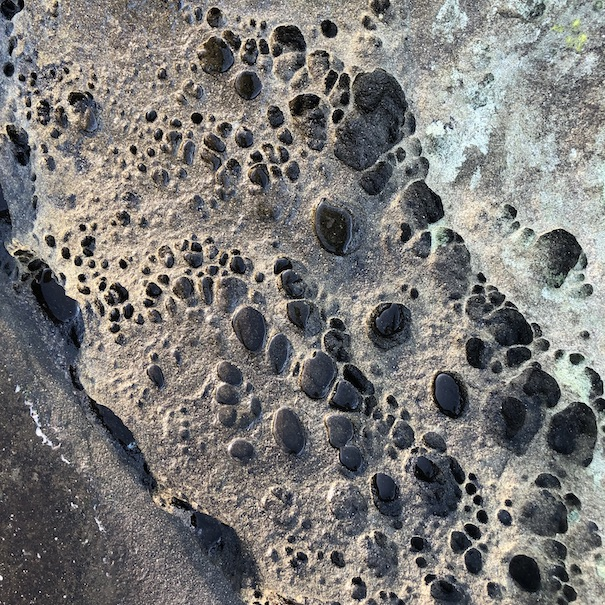
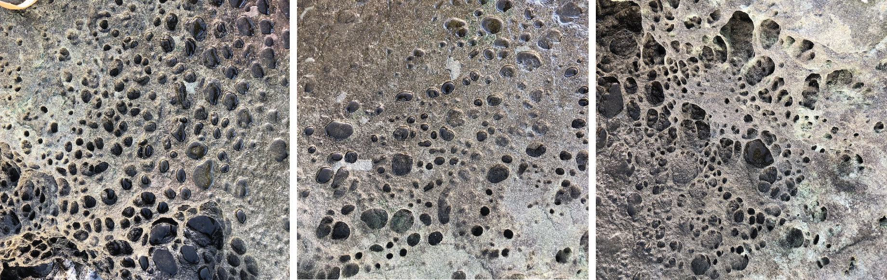
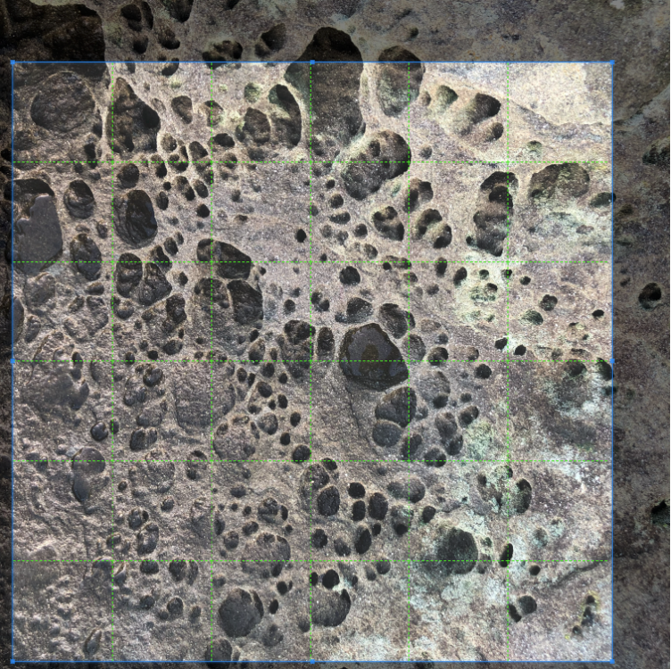
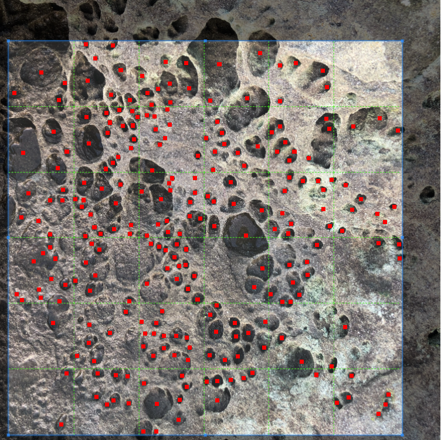
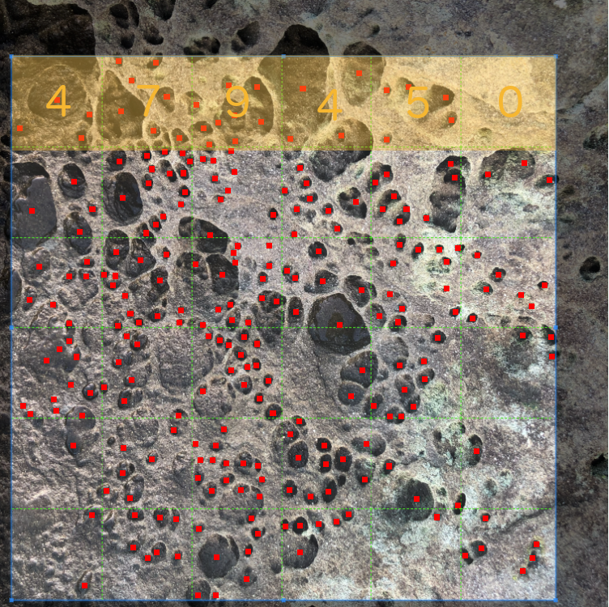

```{r setup, include=FALSE}
knitr::opts_chunk$set(echo = TRUE)
```

## GESC 258- Geographical Research Methods

**Access online version of this document at (https://rpubs.com/majidhojati/gesc258lab2)**

This lab has two parts. Your Lab demonstrator will teach you first part on (January 21th) and the second part on (January 28th). 
This week we review discrete distributions. Sometimes the data we are collecting are not continues. If we are counting rare events for example - the counts will be low and left skewed toward zero likely. As well, counting variables are discrete random variables - they can only take on values of whole integer numbers (i.e., no half counts!). Luckily, the way we work with discrete distributions in R easy. We just have to remember that different distributions have different defining parameters.

## Part I - Poisson Distribution

Our lab this week will examine a specific process of rock weathering in sandstone found in coastal rocky areas in coastal British Columbia. This weathering process produces characteristic ‘honeycomb’ patterns in sandstone which can easily be found in coastal sandstone around the world. These features are called by several names, such as honeycomb weathering, cavernous weathering, and `tafoni`(https://en.wikipedia.org/wiki/Tafoni). In coastal salt-rich environments such as where we will be exploring, we will investigate how this unique pattern of rock weathering forms and how we can characterize their patterns using probability distributions. But most importantly let’s take a look at what we’re talking about:


 
 These rock features are pretty cool to see and very distinctive. Here are a few more examples taken from the same site: all photos were taken at approximately the same vertical distance so the scale is approximately equal across these images.
 
 


### How does honeycomb patterns in sandstone form?
There are a variety of mechanisms that produce these regular weathering patterns in sandstone, but in salt-rich coastal environments such as that here, the primary process is a result of what is called salt crystallization. In short, rockfaces exposed to sunlight have salt-rich water drawn up to the surface where the salt crystallizes as the water evaporates. The salt crystallization exerts pressure on the surround rock to create tiny factures which become the pits we recognize in the pattern above. As a result of this process, we therefore expect to see these interesting features where sandstone has direct sunlight exposure, such as on south-facing sections of coastline.

We can investigate the density of the weathering process. We will take one image as our study dataset, then count the number of pits in different sections of the image. Here we are taking one small section of coastline and enumerating the density of weathering pits for the entire small section. This is a sample - and our population is the sandstone surfaces undergoing this process in general. Think about what potential issues there may be in making inferences from the data to the population in this case.

### Study Image
The image below we will use as our dataset.We have placed a regular 6 x 6 grid over the image which will serve as our sampling units. Then we will count the number of pits in each cell and generate a dataset of counts. Since this will be a dataset of counts, we will consider this a `discrete random variable`.

 

In order to count the number of pits per cell, we have to make some decisions; namely

1. what counts as a pit and
2. how do we associate pits with cells since in many cases the hole crosses cell boundaries.

This is the sort of research decision we have to make carefully, and then later consider how it impacts our analysis. We will use the following criteria. A pit will be defined based on having visible walls (i.e., we can discern the edges/sides of the pit) and further, we will link it with a cell based on the centroid of the pit. Since this step requires some interpretation which may vary - I have done this for you digitizing our dataset of pit centroids, as below:


 


Your first job is to create a dataset by counting the number of pits in each cell. I have done the first row for you to give us a working dataset as an example, but when you do the assignment **you will have to get the counts for all cells** - you should end up with a datset with **36 observations**, each of which is a count.


 
 
 

So to get started our dataset would be created in R as follows:

```{r}
pits <- c(4,7,9,4,5,0)
```

recall why we are treating this as a discrete random variable. Based on our criteria and the nature of the dataset, we have counts - which cannot take on fractional values. This was a decision which impacts how we treat the data. An alternative way to analyze the data would be to measure the fraction of each cell covered by a pit, which we could then treat as a continuous random variable.

### Analyzing Count Data
The first thing we can do if we want to estimate the parameters of the *Poisson* distribution with our dataset, is to calculate the sample statistic estimate of the distributions parameters. The *Poisson* distribution has a probability mass function as follows:
$$P(X = k) = \frac{e^{-\lambda}\lambda^k}{k!}$$
 

and the only important thing for you to know is that there is one unknown quantity required to define it (i.e., one parameter) - which is the **mean** number of events per unit of observation - which in our case is the cells which we counted pits in. The sample estimate of  $λ$  is therefore simply:

```{r}
mean(pits)
```

so we know that is the average number of pits, but we are not sure what the overall distribution would look like. Again we can simulate some new data using our estimate of  $λ$  that we calculated from the data to see

```{r}

simpits = rpois(n=1000, lambda = mean(pits))
hist(simpits, xlab = "Simulated Pit Count Values", main="")
```


which again might vary a bit for you, but should be a distribution centered on around 5 and tailing off around 12 or 14. Lets look at this and notice a few details;

- the lowest value is zero
- the higher values quickly trail off
- the distribution shape is almost normal

the Poisson is useful for what we call `rare events` because of these properties of being bounded by zero on the lower end. If you have count data that has very high counts, the difference between the Poisson and the Normal is negligible and you can just use a Normal distribution (this is called a Normal approximation). We will have a look at normal distribution in `Part II` of this lab.  Lets look at the Poisson functions.

The function `dpois` gives the probability of `x` number of events observed given the expected number specified by  `λ` . Whereas the function `ppois` gives a cumulative probability, we have to specify the upper or lower tail (i.e., equal or less than vs. equal or greater than). Say we wanted to calculate the probability of observing `7` pits in a cell given our mean number per cell of `4.8333333` - we could of course work through the formula on a calculator or using `R` math functions - and it would look like this:

```{r}
#compare this to the probability function noted above
exp(-mean(pits))*mean(pits)^7/factorial(7)
```

but it is much easier to use the built in function dpois to get the probability:

```{r}
dpois(x = 7, lambda = mean(pits))

```

we get the same answer but using `dpois` is a lot cleaner and easier. We can also plot the probability for each of the observed counts in our dataset. We just have to supply the whole vector of counts to the same dpois function

```{r}
plot(pits, dpois(x = pits, lambda = mean(pits)), pch=20, cex=2, xlab = "Pit Count", ylab = "Probability")

```


So now we have the ability to calculate probabilities from the Poisson distribution in R. How do we answer meaningful questions with these tools? While the process of salt crystallization is the dominant one creating the weathering pits, we may want to know how pits form. For example we could ask how many can form before adjacent pit edges dissolve into one larger pit. What do you think the maximum number of pits per unit area is? Where we see large pits form, are these the gradual growth of single pits or the amalgamation of several into one larger one? The other thing to think about is where we have large pits, the count in the cell is likely going to be lower.

### Part I Assignment

1. Calculate the probability of observing a cell with 15 pits based on the sample intensity (λ computed from all cells in the image). Write a sentence interpreting what this means. Include commands used to generate the answer. (out of 2)


2. What is the probability of observing a cell with between 3 and 5 pits (λ computed from all cells in the image)? Write a sentence interpreting what this means. Include commands used to generate the answer. (out of 3)


3. There are two important assumptions to using the Poisson distribution we should consider.

- The probability that an event will occur within a given unit must be the same for all units (i.e. the underlying process governing the phenomenon must be invariant)

- The number of events occurring per unit must be independent of the number of events occurring in other units (no interactions/dependencies).

Write short paragraph (200-300 words) explaining why or why not these assumptions are met in this analysis of the weathering pits dataset. (out of 5)


4. Explore the assumption of independence by calculating the probability of each observed count and noting where on the image any counts with a probability less than 0.10 occur. Comment on whether these are distributed randomly over the image or clumped in specific parts of the image and what this means for the independence assumption. Include an image showing which cells have an unusual (i.e., p < 0.10) number of pits. (out of 5)

> Hint: to answer 4 you can take a screenshot from the lab and use MSPaint (Windows), Photos (Mac) or another graphics program to identify which cells have unusual counts.


## Part II - The Normal Distribution

Our lab this week will examine trees in a coastal forest in British Columbia. In particular we have a small dataset of tree circumferences which we want to analyze. While tree circumference is easy to measure and tells us something about tree size and age, it is more customary to work with tree diameters. A typical measure used to measure tree is `diameter-at-breast-height (DBH)` which is measured `4.5` feet from the ground using a DBH tape.We can get started by converting our measures of circumference to diameter using the relationship between these two quantities which is  

$$diameter=Circumference/\pi$$
recalling that  π  is ratio of a circle’s circumference to its diameter which we can use $3.14159$ as a value. So assuming we have a circumference of 214cm, the diameter would be  

$$214 /3.14159= 68.11837$$
  which in our dataset our expressed in units of centimeters.
### Tree Circumference Data
The data we collected in the video were as follows:

```
272
272
236
154
256
156
143
269
205
175
```

In order to bring the data into `R`, we need to assign these numbers to a data frame which is like a table, or to a vector which is just a bunch of numbers stored in order. A data frame can be made up of multiple vectors (as individual columns in a table). We will make a vector, since we do not have anything other than tree circumference to store. If we had collected information on tree species, condition, site characteristics, etc. we would want to store the data as a table, so we would create a data frame.

```{r}
x <- c(272,272,236,154,256,156,143,269,205,175)

```

What is happening in the command line above? First of all we are making an assignment using the `<-` operator. This means we are assigning whatever is on the right side of the`<-` to what is on the left side. In this case we are creating a vector of numbers representing our tree dataset to a variable called  `x` . The function `c` is being used which all it does is take some values and create a vector from them.

Before going further, as we noted above we want to convert these measures of circumference to diameters. `R` has a special number for π
  which we can use by just typing `pi` in the console. Try it:
  
```{r}
pi

```

So if we wanted to divide all of our values by  π  we could just type the following in the console:

```{r}
x/pi

```

which is good, but this just displays them to the screen. In order to do something with these we want to store them in a new variable. Note that we can use any name we want for variables. We will create a new one called dbh:

```{r}
dbh <- x/pi

```
Now we have a new vector which has our data properly represented in values of dbh which we measured in the field. We can use this vector in subsequent work below.


### The Normal Distribution

Lets pretend that we had a sample size of 1500! Luckily we can create a dataset using simulation pretty easily, and we will based it on our actual sample mean and standard deviation. We will use a function called `rnorm` which basically will generate random samples from a given Normal distribution, we just have to supply the `mean`, `standard deviation`, and sample size.

```{r}

sim_dbh <- rnorm(n=1500, mean=mean(x), sd=sd(x))
```
We don’t want to look at all the values on the screen because there are too many. We can look at the first few, the last few, and then count the number of observations as follows:
```{r}
head(sim_dbh)
```

```{r}
tail(sim_dbh)
```

```{r}
length(sim_dbh)
```

because these are randomly simulated values, yours may differ a bit from what you see here, but there should be 1500 values.

We can look at the distribution of values by plotting the histogram:

```{r}

hist(sim_dbh, xlab = "Simulated DBH(cm) Values", main="")
```


We can also create a line showing the theoretical distribution that would be the population standard deviation:

```{r}

x = seq(0,200,.1)
y = dnorm(x, mean=mean(dbh), sd=sd(dbh))
plot(x,y, type="l", main="Normal Distribution")

```


The key point here is that from this smoothly varying distribution, we can calculate probabilities. Say we sampled a tree with a dbh of 100, we can ask the question - what is the probability of finding a tree with a dbh of 100 or greater from this distribution, that is akin to finding the area under the curve for everything to the right of the 100 value on the x-axis. We will use a special probability function in `R` to get this, it is called pnorm

```{r}
pnorm(q=100, mean = mean(dbh), sd=sd(dbh), lower.tail = FALSE)
```

which tells us that the probability of sampling a tree with a dbh value of 100 or greater is `0.03` - so pretty unlikely.

### Using z-scores instead of raw data to more easily find probabilities from a normal distribution
*z-score* is simply a score we can calculate for every observation which standardizes the data to a standard normal distribution. This means it eliminates the units of the data (i.e., we’re no longer in the centimeters we measured) - but it makes scores comparable across datasets and easier to quickly interpret.

The z-score formula is  
$$z_i = \frac{x_i - \bar{x}}{\sigma}$$
  which is just the observation, minus the mean, divided by the standard deviation. We’ll go back to our smaller dataset to illustrate:

```{r}
(dbh - mean(dbh)) / sd(dbh)
```

*z-score* have the properties that values less than zero are for observations below the mean, values greater than zero are for observations above the mean, and values of zero correspond to the mean (which are rare). Moving back to our hypothetical tree with a dbh of 100, lets calculate its z-score:

```{r}

(100 - mean(dbh)) / sd(dbh)
```

which gives us a z-score of `1.881457` If we checked the probability value associated with this *z-score* we would see that it matched the one we got above, we just no longer have to specify the mean and sd because this is referenced to a standard normal distribution

```{r}
pnorm(1.881457, lower.tail=FALSE)

```

### Part II Assignment

1. Calculate the probability of finding a tree with a dbh of 90 or greater based on the sample mean and sample standard deviation above. What is the *z-score* associated with a dbh of 90 cm? Include commands used to generate the answer. (out of 3)


2. Create a new dataset with a mean and standard deviation of your choosing and a sample size of 100. Plot the histogram being sure to label axes appropriately. (out of 3)


3. Do you think the sample of trees we collected was representative of the wider forest? What would be some potential issues with inferring characteristics of the forest from this dataset? (out of 4)


## Hand in

Please submit your answers on MLS under Assignment 1. Your final report should be in `pdf` format. Also Please make sure to include **clean** codes and their results. The document formatting of your assignment has *5 marks*. 

## Extra information about formatting your reports

- An intro to document formatting (https://ohiostate.pressbooks.pub/feptechcomm/chapter/8-formatting/)

- Formatting codes in your documents: (https://owlcation.com/stem/code-snippets)

### Two Microsoft word addons for code formating
1. https://appsource.microsoft.com/en-us/product/office/WA200000011

1. https://appsource.microsoft.com/en-us/product/office/WA104382008?tab=Overview

## Credit 

This lab material is adopted from GESC 258- Labs originally developed by Dr. Colin Robertson.
