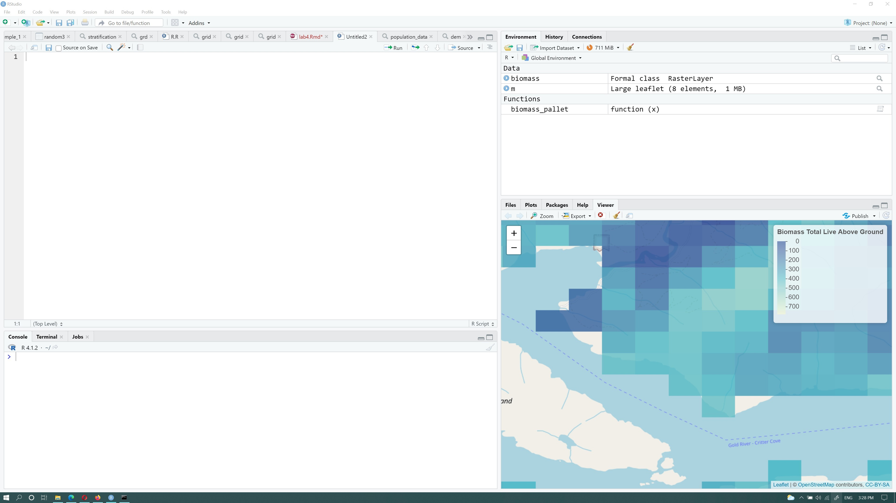

```{r setup, include=FALSE}
knitr::opts_chunk$set(echo = TRUE)
```

# GESC 258- Geographical Research Methods
## Sampling Methods

In this week's lab we are going to learn how different sampling methods work when we have spatial data. Sampling is the process of selecting a part of a population to estimate the characteristics of the whole population. The characteristics could be the total or mean value of an attribute regarding the population.

In spatial sampling, we collect samples in a two-dimensional framework. The sampling scheme is designed to maximize the probability of including the spatial variation of the study population.

There are different methods to collect a sample, in this lab we will focus and compare results between three sampling methods:

1. Simple random sampling - randomly selecting sample points in a study region, where each location has an equal opportunity to be sampled.

2. Systematic sampling - Systematic sampling is a type of probability sampling method in which sample members from a larger population are selected according to a random starting point but with a fixed, periodic interval.

3. Stratified sampling - the study region is divided into groups a.k.a. strata by a collective characteristic of the study region (elevation, land use, etc.). Then for each strata, a spatial random sample is collected and combined to one sample.

We will be using Above ground biomass data this week. `Above ground biomass (AGB)` is defined as “the aboveground standing dry mass of live or dead matter from tree or shrub (woody) life forms, expressed as a mass per unit area”. We will apply different sampling methods to `estimate above ground biomass in vancouver island (study area)` and compare the computed sample mean with the actual mean of the population. At the end of this lab we will be able to see how sample size and sampling design can impact the results. 

> Important! to complete the analysis it is essential to have the population mean and standard deviation. We will discuss that in the `Population` section


## Installing necessary packages
When working with R projects we usually need to use some extra packages. Packages in `R` are a set of tools that add extra functions to R. To use packages we first need to install them. We can install a package using `install.packages` function. So to get started open your R studio, and run the following codes:


```{r eval=FALSE, warning=FALSE}
install.packages('raster')
install.packages("rgdal")
install.packages("sf")
install.packages("sp")
install.packages("leaflet")
```

> NOTE: Installing packages is a one-time process. So once you have installed the necessary packages you don't need to install them again. 

Once you install the necessary packages, you need to import them into your current R environment to be able to use them. To import them we use `library` function. Use following lines of the code to import installed packages into your environment.

```{r message=FALSE, warning=FALSE}
library(raster)
library(leaflet)
library(sp)
library(sf)

```

> NOTE: Everytime you want to use R you need to import necessary package into the environment using `library` function.


## Population

So in statistics, we usually don't have access to the population. This is why we use sampling methods. However, in this lab we have a map layer that includes AGB data. We assume this map layer is our population. So if we calculate the mean value of this layer's data we will have our population's mean or $\mu$. So if we select a set of data from this AGB map layer we can assume it as a sample collected from our population.  You might ask, how we get a hold of this data. These data are usually generated from satellite imagery data or by other modeling approached. This particular dataset is downloaded from (https://open.canada.ca/data/en/dataset/ec9e2659-1c29-4ddb-87a2-6aced147a990) and you can read more about it in the provided link. These data are from 2001 to 2011 and are available from entire Canada.  I have already clipped these data for the study area for you.

We will use this data to measure population's mean $\mu$ and population's standard deviations $\sigma$. We also select our samples from this layer and compare our calculated mean from sample with our real $\mu$ value. So lets have a look at the population data:


> NOTE: These data are in *Raster* format. You have already learned about `Vector data` in previous courses (e.g GG251). Here we learn about a new data model which is very common in GIS. Raster data are simple images that have geographic coordinates. so each pixel/cell in that image can store a value (our multiple values) and represents a geographical area. Rasters are one of the main data models in GIS. You can learn more about rasters in the following links, please watch the video and have a look at the website to learn about them before continuing to the next section
> https://www.youtube.com/watch?v=VeI4n7duavI
> https://vector.geospatial.science/textbook/section-three-raster-data


> We will use a R package called `leaflet` to generate interactive maps in R. Learning leaflet is not part of this lab and you just need to copy and paste the codes to be able to visualize maps. However, it gives you some idea how interactive maps work in R. You can google `R leaflet` to learn more about interactive maps in R.


Now that you have some idea about *raster* data type, run the following codes in your R script. Read the comments to learn about each line of the code. 
```{r message=FALSE, warning=FALSE}

biomass <- raster("https://www.dropbox.com/s/zvzqb4a0qvhulye/bc_NFI_MODIS250m_2011_kNN_Structure_Biomass_TotalLiveAboveGround_v1_victoria_4326.tif?dl=1") # we read our raster as a new R object

## Lets show it on the map
biomass_pallet <- colorNumeric(c("#0C2C84", "#41B6C4", "#FFFFCC"), values(biomass),na.color = "transparent") # in this like we tell R how to color each pixel on the map. 
# In the next section we generate an interactive map using leaflet() function. then we use addRasterImage to add our raster image to the map. We use addLegend to add a legend to the map.
m <- leaflet() %>% addTiles() %>%
  addRasterImage(biomass, colors = biomass_pallet, opacity = 0.8) %>%
  addLegend(pal = biomass_pallet, values = values(biomass),title = "Biomass Total\n Live Above Ground") 
m
```

In the above code, I use `raster` function to read data from a `url` and save it as an R object called `biomass`. Notice `.tif` section at the end of the URL. `.tif` is a common file extension for the raster files.  As we said earlier, in the raster images each pixel has a value, in our case the value of these each pixel is AGB data and its unit is tone per hectare. So if a pixel in this map layer has a value of 100, it means the area that is covered by that pixel has 100 tone per each hectare. Zoom in the interactive map to see the actual pixel data.


 


You can access AGB values using the following functions:

```{r eval=FALSE, include=T}
p_data <- values(biomass)[!is.na(values(biomass))] # we remove NA data. Recall what are NA data from the first lab
head(p_data) # Surprise, it is just a set of numbers, guess what, We have a distribution here
```
```{r echo=FALSE}
p_data <- values(biomass)[!is.na(values(biomass))] 
knitr::kable(head(p_data), caption = 'Population') 
```
In the above lines, I have removed missing data from the population using `!is.na` function. Now I am able to plot a histogram of my data.

```{r}

hist(p_data,xlab="Above Ground Biomass t/ha",main="Histogram of AGB")
```

We can calculate mean and stdev of our population's data:

```{r}
p_mean <- mean(p_data)
p_sd <- sqrt(sum((p_data - p_mean)^2) / (length(p_data)))
p_mean
p_sd
```

Now that we have our population mean $\mu$ and stdev $\sigma$ we can start sampling from population.


## Simple Random Sampling

Simple random sampling is one of the easiest methods of sampling, We just need to determine the sample size and select population members randomly. In this example unit of analysis is each pixel in the raster file. We define a sample size of 10. If you want to chose other sample sizes you need to change this value. 

```{r}
sample_size <- 10
sample_1 <- sampleRandom(biomass, size=sample_size, cells=TRUE, sp=TRUE) 

knitr::kable(head(sample_1@data), caption = 'Selected Cells')
```
The output of the `sampleRandom` function has several members. If you run `sample_1@data` it will give you the selected pixel number and its associated value. We later use this to calculate mean and sd of our sample. If you call `sample_1@coords` it gives you `x` and `y` coordinate of the selected pixels (cells). We use these data to generate a map. So 

```{r}
map_sample_1 <- m %>% leaflet::addCircles(sample_1@coords[,1],sample_1@coords[,2],popup = paste("Pixel Value:",sample_1$bc_NFI_MODIS250m_2011_kNN_Structure_Biomass_TotalLiveAboveGround_v1_victoria_4326.tif.dl.1),color="red") 
map_sample_1

```


You can click on each red point and see the value of the pixel under that point. Now that we have our sample, we are able to calculate sample mean $\bar{x}$ and $s$.


> Recall that sample standard deviation is computed using: $\sqrt{\frac{\sum\limits_{i=1}^{n} (x_i - \bar{x})^2}{n-1}}$

```{r}

sample_1_mean <- mean(sample_1$bc_NFI_MODIS250m_2011_kNN_Structure_Biomass_TotalLiveAboveGround_v1_victoria_4326.tif.dl.1)
sample_1_sd <- sqrt(sum((sample_1$bc_NFI_MODIS250m_2011_kNN_Structure_Biomass_TotalLiveAboveGround_v1_victoria_4326.tif.dl.1 - sample_1_mean)^2) / (sample_size - 1))

sample_1_mean
```

> NOTE: You might get different values as sample mean, which is fine, since we are selecting a random sample from the population and every sample has different mean

Now that we have our $\bar{x}$ and $s$ we can find a confidence interval for 95\% of confidence level. Recall our confidence level equation from previous labs:

> point estimate +/- critical value * standard error

Follow these steps to find confidence intervals

1. Set the probability. We will use a 95% confidence level.

2. Now we need to find a z-score associated with 95% probability. We do this by taking the inverse so $1-0.95$. We could then use `qnorm` to find the z-score for 0.05. But this would be wrong because `qnorm` gives us one-tailed probabilities and we really need two-tailed (i.e., 0.05 split into the upper and lower tails), so we would use `qnorm(0.05/2)` which would give us a lower z-score associated with .025 probability. This is what we use as the **critical value** of the confidence interval.

3. Now to find the interval in `R` we just need the standard error - which we already know is  $\frac{\sigma}{\sqrt{n}}$

```{r}
z_crit = qnorm(0.05/2, lower.tail = FALSE)
sample_1_lower = sample_1_mean - (z_crit * (p_sd/sqrt(sample_size)))
sample_1_upper = sample_1_mean + (z_crit * (p_sd/sqrt(sample_size)))

sample_1_lower
sample_1_upper
```

Now that we have the confidence interval. lets plot them.


```{r}
plot.new() # create a new plot
plot.window(xlim=c(0, 6), ylim=c(min(p_data), max(p_data)))  # set our plot's ylim and xlim
box() # draw a box around our plot

axis(side=1, at=seq(2,4, by=1), labels=c("Simple","Systematic","Stratified")) # define bottom axis values
axis(side=2, at=seq(min(p_data),max(p_data), by=50), labels=seq(min(p_data),max(p_data), by=50)) # define left axis value

mtext("Biomass", side = 2, las=3, line=3 ) # you can change values of las and line to see their effect on your axis's title
mtext("Sampling method", side = 1, las=1, line=3) #set title of x bar

abline(h=p_mean,col="orange",lwd=2, lty="dashed") # draw a horizontal line on y=p_mean
text(x = 5.5, y = p_mean, "Exact Population's \n mean") # add a text on the horizontal line


points(x = 2, y = sample_1_mean, pch=20, cex=1) #add a point for our sample mean
arrows(2, sample_1_lower, 2, sample_1_upper, length=0.05, angle=90, code=3) # hack: we draw arrows but with very special "arrowheads" to draw an error bars

```


## Systematic Sampling

The second sampling method we will use is called systematic sampling. To do so we first need to create a regular grid on top of the study area and then select center point of each grid cell. Once we have all of the center points, we call it our sampling frame. We then can select from sampling frame based on a systematic selection method (like every other point and so on). so lets get started.

To generate our regular grid we use a function called  `st_make_grid`. The first input of this function is the raster file that you want to draw a grid on top of it. The second parameter is the type of output grid. It can be `polygons` which generates the boundary of the grid cells as the output. You can also set it to `centers` and it will return center point of each grid cell (we will use this functionality later). the third parameter of this function is number of grid rows and columns. In this case we are going to have a `20 by 20` grid. 
```{r}

grid <- st_make_grid(biomass,what = "polygons",n = c(20, 20)) #making a 20 by 20 grid on top of our study area. 

map_grid <- m %>% addPolygons(data = grid)
map_grid
```

Now lets extract the center points of the grid cells. 

```{r}

grid <- st_make_grid(biomass,what = "centers",n = c(20, 20)) # we use the same function as before, but this time we set the second parameter to centers to give us the center points

map_grid <- m %>% addCircles(data = grid)
map_grid
```

As you see our sampling grid has some issue. For example many of our grid cells are outside of the study area. So we need to clean those cells. Also since this time we did not use `sampleRandom` function, we need to assign raster value under each point to its representative point.

```{r}
## In the next following lines we extract raster values under each point and remove the NA values
grid_sf <- st_as_sf(grid) 
grid_points_with_values <- extract(biomass,grid_sf) #Extract raster pixel values under each point
grid_sf <- st_sf(value=grid_points_with_values,grid) 
grid_sf <- grid_sf[!is.na(grid_sf$value),] #remove the NA values

# show them on the map
map_sample_2 <- m %>% addCircles(data = grid_sf,popup = paste("Biomas Value:", grid_sf$value),color="yellow") 
map_sample_2
```

Now that we have our regular grid, without any error grid data, we will need to select 10 items from our points. But we cannot do it randomly. it should follow a systematic form. To do so we need to have a `systematic sample interval`.We can divide total number of items in our sampling frame by the sample size and find our systematic sample interval. 

```{r}

sample_2_interval <- round(length(grid_sf$value)/sample_size) #total grid points divided by sample size

# select sample items based on the sample interval we just calculated
grid_sf_grid <- grid_sf$grid[1:(length(grid_sf$grid)/sample_2_interval)*sample_2_interval]
grid_sf_value <- grid_sf$value[1:(length(grid_sf$value)/sample_2_interval)*sample_2_interval]

#show the selected samples on the map
map_sample_2 %>% addCircles(data=grid_sf_grid,color="red")

```

now we have our sample. we will continue calculating our CI, sample mean and stdev as usual.

```{r}

sample_2_mean <- mean(grid_sf_value)
sample_2_sd <- sqrt(sum((grid_sf_value - sample_2_mean)^2) / (sample_size - 1))
sample_2_mean
```

And for the CI:
```{r}
z_crit = qnorm(0.05/2, lower.tail = FALSE)
sample_2_lower = sample_2_mean - (z_crit * (p_sd/sqrt(sample_size)))
sample_2_upper = sample_2_mean + (z_crit * (p_sd/sqrt(sample_size)))
sample_2_lower
sample_2_upper
```

And we need to update our previous plot

```{r}
plot.new() 
plot.window(xlim=c(0, 6), ylim=c(min(p_data), max(p_data))) 
box()

axis(side=1, at=seq(2,4, by=1), labels=c("Simple","Systematic","Stratified"))
axis(side=2, at=seq(min(p_data),max(p_data), by=50), labels=seq(min(p_data),max(p_data), by=50))
mtext("Biomass", side = 2, las=3, line=3 )
mtext("Sampling method", side = 1, las=1, line=3)

abline(h=p_mean,col="orange",lwd=2, lty="dashed")
text(x = 5.5, y = p_mean, "Exact Population's \n mean")

points(x = 2, y = sample_1_mean, pch=20, cex=1)
arrows(2, sample_1_lower, 2, sample_1_upper, length=0.05, angle=90, code=3)

## new part of the code
points(x = 3, y = sample_2_mean, pch=20, cex=1 , col="red")
arrows(3, sample_2_lower, 3, sample_2_upper, length=0.05, angle=90, code=3, col="red")
```


## Stratified Random Sampling

In the stratified random sampling, sample frame split into mutually exclusive homogeneous sub-groups (i.e., strata) and then a simple random sampling will be done within these groups. To get started we first need to define our strata. In this case we will use elevation to define our strata. The elevation data are usually stored as data models called Digital Elevation Models (DEM)`. DEM files are simple raster data that value of each pixel/cell is the elevation above sea level. Lets take a look at a DEM file.


```{r}

dem <- raster("https://www.dropbox.com/s/nrxzy6bemzg4tks/dem_lowresolution.tif?dl=1")
values(dem)[values(dem) <= 0] = NA # we replace the values less than and equal to zero meters with NA.


## Plot it on the map
dem_pallet <- colorNumeric(c("#008435", "#33cc00", "#f4f071","#f4bd45","#99642b","#ffffff"), values(dem),na.color = "transparent")

map_dem <- leaflet() %>% addTiles() %>%
  addRasterImage(dem, colors = dem_pallet, opacity = 0.8) %>%
  addLegend(pal = dem_pallet, values = values(dem),title = "DEM (elevation m)") 
map_dem
```


Now that we have our DEM file. We will define our strata as follows: 

1. Strata 1: $elevation <=900$
2. Strata 2: $900 < elevation$

To do so we will do following:

```{r}

strata_1 <- dem # duplicate our dem file as strata_1
values(strata_1)[values(strata_1) <= 900] = 1  # replace values <= 900 with 1 
values(strata_1)[values(strata_1) > 900] = NA  # replace other values with NA

strata_2 <- dem # duplicate our dem file as strata_2
values(strata_2)[values(strata_2) <= 900] = NA #replace other values with NA
values(strata_2)[values(strata_2) > 900] = 2  # replace values > 900 with 2 


## lets show them on the map
strata_bins <- colorBin(c("#008435", "#99642b"),bins = 2, c(1,2),na.color = "transparent")
leaflet() %>% addTiles() %>%
  addRasterImage(strata_1, colors = strata_bins, opacity = 0.8)%>%
  addRasterImage(strata_2, colors = strata_bins, opacity = 0.8)%>%
  addLegend(pal = strata_bins, values = c(1,2),title = "Strata 1 & 2") 

```


Now that we have two sub-groups we just need to perform a simple random sample on each subgroup. 

```{r}
# we clean some of the missing data
values(strata_1)[is.na(values(biomass))] = NA 
values(strata_2)[is.na(values(biomass))] = NA

# perform sampleRandom Function on each strata
sample_3_st1 <- sampleRandom(strata_1, size=round(sample_size/2), cells=TRUE, sp=TRUE) 
sample_3_st2 <- sampleRandom(strata_2, size=round(sample_size/2), cells=TRUE, sp=TRUE) 

# extract values of each strata 
values_st1 <- values(biomass)[sample_3_st1$cell]
values_st2 <- values(biomass)[sample_3_st2$cell]

#show them on the map
map_sample_3 <- m %>% leaflet::addCircles(sample_3_st1@coords[,1],sample_3_st1@coords[,2],popup = paste("Pixel Value (Strata 1):",values_st1),color = "red") %>% leaflet::addCircles(sample_3_st2@coords[,1],sample_3_st2@coords[,2],popup = paste("Pixel Value (Strata 2):",values_st2),color = "orange") 
map_sample_3

```

Now we just need to calculate CI and sample mean and sample stdev:

```{r}
# combine selected values from each strata into one array of numbers
sample_3_values <- c(values_st2,values_st1)
# calculate mean and stdev
sample_3_mean <- mean(sample_3_values)
sample_3_sd <- sqrt(sum((sample_3_values - sample_3_mean)^2) / (sample_size - 1))
sample_3_mean

z_crit = qnorm(0.05/2, lower.tail = FALSE)
sample_3_lower = sample_3_mean - (z_crit * (p_sd/sqrt(sample_size)))
sample_3_upper = sample_3_mean + (z_crit * (p_sd/sqrt(sample_size)))
sample_3_lower
sample_3_upper
```

And now we plot them 
```{r}
plot.new() 
plot.window(xlim=c(0, 6), ylim=c(min(p_data), max(p_data)))  
box()

axis(side=1, at=seq(2,4, by=1), labels=c("Simple","Systematic","Stratified"))
axis(side=2, at=seq(min(p_data),max(p_data), by=50), labels=seq(min(p_data),max(p_data), by=50))
mtext("Biomass", side = 2, las=3, line=3 ) 
mtext("Sampling method", side = 1, las=1, line=3)

abline(h=p_mean,col="orange",lwd=2, lty="dashed")
text(x = 5.5, y = p_mean, "Exact Population's \n mean")

points(x = 2, y = sample_1_mean, pch=20, cex=1)
arrows(2, sample_1_lower, 2, sample_1_upper, length=0.05, angle=90, code=3)

points(x = 3, y = sample_2_mean, pch=20, cex=1 , col="red")
arrows(3, sample_2_lower, 3, sample_2_upper, length=0.05, angle=90, code=3, col="red")

## new part of the code
points(x = 4, y = sample_3_mean, pch=20, cex=1 , col="green")
arrows(4, sample_3_lower, 4, sample_3_upper, length=0.05, angle=90, code=3, col="green")

```

Now you can see the impact of each sampling method on accuracy of our results. Try to explain why each sampling method is resulting different sample mean and what sampling method is more accurate. Keep in mind that our sample size in this example was 10 for each method. 

## Assignment

1. Write down the sample mean and confidence interval you calculated for a sample size of 10 per each sampling method. Repeat the above steps with two more sample sizes (e.g 15, 30) and calculate sample mean and confidence intervals for 95% confidence level. Write the results in a table and discuss them (out of 6). 


2. Calculate `sampling error` $(Sample Mean) - (Populalation Mean)$ for each pair of sampling method (simple random, systematic and stratified) and sample size (10,15,30) (total of 9 pairs) and discuss what sampling method do you think works better in this case (out of 5).

3. Using bellow code snippet, generate three plots (one per each sampling method). Use `sample size` for `x` axis and `sample mean` on `y` axis. Add `exact population mean` on the plot too. Explain each plot and discuss the relation between sample size and accuracy of the results (out of 10).


```{r warning=FALSE}

## Replace the following numbers with your own numbers for each sampling method
#data for sampling method 1 with sample size =10
sample_1_mean <- 191.09
sample_1_lower <- 116.35
sample_1_upper <- 265.84
#data for sampling method 1 with sample size =15
sample_2_mean <- 148.45
sample_2_lower <- 87.42
sample_2_upper <- 209.48
#data for sampling method 1 with sample size =30
sample_3_mean <- 223.17
sample_3_lower <- 180.02
sample_3_upper <- 266.33

### Only change labels
#############################
x <- c(10,15,30)
y <- c(sample_1_mean,sample_2_mean,sample_3_mean)
y1 <- c(sample_1_upper,sample_2_upper,sample_3_upper)
y2 <- c(sample_1_lower,sample_2_lower,sample_3_lower)

lo <- loess(y~x)

plot.new()
plot.window(xlim=c(5, 40), ylim=c(min(p_data), max(p_data)))  # set our plot's ylim and xlim
box()
axis(side=1, at=seq(5,40, by=1), labels=seq(5,40, by=1))
axis(side=2, at=seq(min(p_data),max(p_data), by=50), labels=seq(min(p_data),max(p_data), by=50))

mtext("Biomass", side = 2, las=3, line=3 ) # Y axis label
mtext("Sampling Size", side = 1, las=1, line=3)  # X axis label
title("Sampling Size effec for Random Sample method")  # Plot Title

# CI polygon
polygon(c(x, rev(x)), c(y1, rev(y2)),col = adjustcolor(col = "black", alpha = 0.25), border = NA)

lines(x,predict(lo), col='red', lwd=2)

# exact population mean
abline(h=p_mean,col="orange",lwd=2, lty="dashed")
text(x = 37, y = p_mean, "Exact Population's \n mean")


points(x = 10, y = sample_1_mean, pch=20, cex=1)
arrows(10, sample_1_lower, 10, sample_1_upper, length=0.05, angle=90, code=3)

points(x = 15, y = sample_2_mean, pch=20, cex=1 , col="red")
arrows(15, sample_2_lower, 15, sample_2_upper, length=0.05, angle=90, code=3, col="red")

points(x = 30, y = sample_3_mean, pch=20, cex=1 , col="green")
arrows(30, sample_3_lower, 30, sample_3_upper, length=0.05, angle=90, code=3, col="green")


```


4. What other factors do you think impact the accuracy of our results apart the sampling method and sample size. Think about how the input data are collected, or the resolution of raster files and their impacts on the final results (out of 4).


## Hand in

Please submit your answers on MLS under Assignment 3 folder. Your final report should be in `pdf` format. Also Please make sure to include **clean** codes and their results when it is *applicable.* The document formatting of your assignment has *5 marks*. 


# Citations

Tracking forest attributes across Canada between 2001 and 2011 using a k nearest neighbors mapping approach applied to MODIS imagery. 2018. Beaudoin, A.; Bernier, P.Y.; Villemaire, P.; Guindon, L.; Jing Guo, X. Can. J. For. Res. 48: 85-93. https://open.canada.ca/data/en/dataset/698dc612-5059-43ee-84f3-49756e6d5ad6
