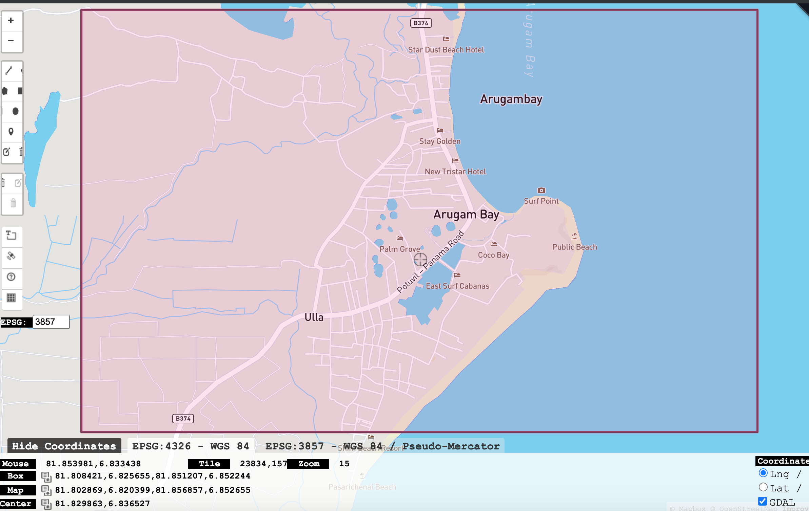
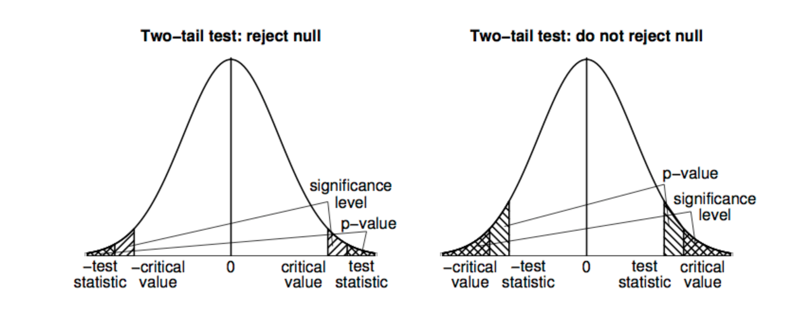

```{r setup, include=FALSE}
knitr::opts_chunk$set(echo = TRUE)

```
# GESC 258- Geographical Research Methods
## Hypothesis testing for means
We are going to explore one of my favorite geospatial technologies for our foray into hypothesis testing, Global Positioning Systems (GPS), which is a specific form of the more general Global Navigation Satellite Systems (GNSS). With the advent of GPS chips in mobile phones, location-aware applications and services are now extremely widely used. The quality of GPS sensors varies considerably and an affect how we use the positioning information we get from them. One particular issue with GPS is that it does not work in doors. If you have even a rough understanding of how GPS works, you will know you have to connect to satellites that receive messages to your receiver, and connecting to multiple satellites allows your exact position on the surface of the earth to be located. If we are inside, we cannot receive signals broadcast from space.

Now this issue can get a little more complex when we are using GPS outdoors in areas where we do not have a clear view of the sky. In particular, GPS signals can reflect off of objects in the path between our receiver and the satellite - a phenoemna known as GPS multipath error as the error is due to the multiple paths the signal takes. More advanced GPS receivers use different techniques to minimize this issue. However, multipath error can still be an issue in urban environments with tall buildings nearby or in forested areas with canopy cover.

In this lab what we want to explore is the difference in reported positioning for two receivers. To do a proper error analysis of these units, we would really need to compare them to a third independent benchmark, such as a survey marker or a GPS position obtained from a highly accurate positioning system using differential corrections. Lacking that - we will simply compare the positions to each other, to ask; *are the positions statistically different.* Also we will first try the whole process using fake GPS data.

## Examining with Fake Data
We will first create some fake geographic data to examine. One of the great things about working with `R` is that you can usually find a package to do just about anything you want to do. In this case we want an `R` function to generate random geographic coordinates. We will use `runif` which generates random uniform numbers and just set the min and max to -180 and +180 for longitude and -90 and +90 for latitude. Here is an example of how we select a random value between -180 and +180 for longitude and -90 and +90 for latitude:
```{r}
runif(1, min = -180, max = 180)
runif(1, min = -90, max = 90)
```


Now we will need a bounding box within which points should be generated. Luckily there is a website (http://bboxfinder.com/) that makes this process very easy from which you can copy the bounding box coordinates.

Given that we’re probably all desparate to travel at this point, I am going to go to one of my favorite places, Arugum Bay in Sri Lanka(https://www.google.com/search?q=arugam+bay&sxsrf=ALeKk00ld2CQx0-28Kx7Vl-UBgkd7CW3gA:1614621081426&source=lnms&tbm=isch&sa=X&ved=2ahUKEwiC54Sg1I_vAhWLt54KHdJFArEQ_AUoAnoECBEQBA&biw=1273&bih=757).


 

Feel free to change this somewhere you want to go! For my study area, we can see the bounding box is `81.808421,6.825655,81.851207,6.852244` and this is reported in Longitude, Latitude pairs for the box, and when we look at the `rg_position` help it tells it that it requires this information as numeric vector of the form west (long), south (lat), east (long), north (lat). Lets try it (pay attention to the order of the numbers in the following function)

```{r}
lon <- runif(1, min = 81.808421, max = 81.851207)
lat <- runif(1, min = 6.825655, max = 6.852244)
c(lon,lat)
```

Try plugging the result into google maps to see if it lands in the correct location (Google Maps takes latitude/longitude in the search box so you’ll have to switch the order).


 

We can get more points by increasing the count argument as follows:

```{r}

lon <- runif(5, min = 81.808421, max = 81.851207)
lat <- runif(5, min = 6.825655, max = 6.852244)
cbind(lon,lat)

```

now the `runif` function returns a list of pairs of longitude/latitude pairs. We can convert them to a data frame with a little `r `magic -

```{r}
set.seed(123)
X1 <- runif(29, min = 81.808421, max = 81.851207)
Y1 <- runif(29, min = 6.825655, max = 6.852244)
df1 <- data.frame(X1, Y1)


X2 <- runif(29, min = 81.808421, max = 81.851207)
Y2 <- runif(29, min = 6.825655, max = 6.852244)
df2 <- data.frame(X2, Y2)


```

so now we have two data frames each with 29 geographic cooridnates in our area of interest.

```{r}
head(df1)
head(df1)
```


Now, back to GPS and hypothesis testing.

We will pretend `df1` are coordinates from one GPS and `df2` are coordinates from another GPS. Since these were just randomly created we won’t expect the coordinates to be close - but the idea of comparing coordinates will be the same.

## t-test
To compare the mean of 1 group to a specific value, or to compare the means of 2 groups, you do a `t-test.` The `t-test` function in R is `t.test()`. The `t.test()` function can take several arguments, here I’ll emphasize a few of them. To see them all, check the help menu for t.test (`?t.test`).


```{r echo=FALSE}
ttesttable <- data.frame(
  Argument = c("`x`", "`mu`", "`alternative`"),
  Description = c("A vector of data whose mean you want to compare to the null hypothesis `mu`", "The population mean under the null hypothesis. For example, `mu = 0` will test the null hypothesis that the true population mean is `0`.", "A string specifying the alternative hypothesis. Can be `\"two.sided\"` indicating a two-tailed test, or `\"greater\"` or `\"less\"` for a one-tailed test.")
)
knitr::kable(ttesttable)

```

In a one-sample t-test, you compare the data from one group of data to some hypothesized mean. For example, if someone said that average error of GPS data is 5 meters, we could conduct a one-sample test comparing the data from a sample to a hypothesized mean of 5. To conduct a one-sample t-test in R using t.test(), enter a vector as the main argument `x`, and the null hypothesis as the argument `mu`.


## One-Sample Hypothesis Testing
First we will test the hypothesis of whether the difference between two fake gps data is equal to zero. 

$$H_0: \mu = 0$$
$$H_a: \mu \ne 0$$

where $\mu$ is the *population mean difference*. To start we have to compute our variable analysis. Given that we have a two-dimensional measure of location that we want to summarize with a single vector, we will convert the geographic coordinates to distance using pythagorous theorum (https://en.wikipedia.org/wiki/Pythagorean_theorem) which in `r` is just implementing

$$d = \sqrt{(x_1-x_2)^2 + (y_1-y_2)^2}$$

```{r}
d <- sqrt((df1$X1 - df2$X2)^2 + (df1$Y1 - df2$Y2)^2)
```

so now we are testing  $H_0: \mu = 0$ on the sample mean difference in `d`. The function for doing a t-test in `r` is `t.test`.

```{r}
t.test(d, mu=0)
```

> Use `?t.test` in the R console to learn more about this function. Pay attention to `alternative` argument in the documentation of this function. This parameter helps you to perform a correct t.test

As you can see, the function printed lots of information: the sample mean was `0.019`, the test statistic (`11.116`), and the p-value was `8.866e-12` (which is virtually 0). Because `8.866e-12` is less than `0.05`, we would reject the null hypothesis that the true mean is equal to 0.

> Interpretting p-value: look at the following image. If our level of confidence is 95\% so our significance value $\alpha=0.05$. Now we look at the type of out t-test. It is a two-tail test (why?). So we use the following charts to make a conclusion.Since p-value is far less than 0.05 $`8.866e-12`< 0.05$. As a result the left side image is valid and we reject the null hypothesis that the true mean is equal to 0.

 


Now, what happens if I change the null hypothesis to a mean of 0.02 (a close value of my sample mean)? Because the sample mean was 0.019, quite close to 0.02, the test statistic should `decrease`, and the `p-value` should increase:

$$H_0: \mu = 0.02$$

$$H_A: \mu \ne 0.02$$
 
```{r}

t.test(d, mu=0.02)
```
 Just as we predicted! The test statistic decreased to just -0.4, and the p-value increased to 0.68. In other words, our sample mean of 0.019 is reasonably consistent with the hypothesis that the true population mean is 0.02.
 
 > Interpretting p-value: look at the above histograms again. If our level of confidence is 95\% so our significance value $\alpha=0.05$. Now we look at the type of out t-test. It is a two-tail test. Since p-value is far more than 0.05 $0.6889 > 0.05$. As a result the right side image is valid and we fail to reject the null hypothesis that the true mean is equal to 0.02.

*Hand Calculation method:* As per lecture slides the way we calculate a t-statistic for our vector d is:

$$t = \frac{\bar{x} - \mu}{\sigma_{\bar{x}}}$$
where   $\sigma_{\bar{x}}$ is $\frac{s}{\sqrt{n}}$, where $\mu=0$, which we can hand-calculcate in` r` as: 

```{r}
t <- (mean(d) - 0)/ (sd(d)/sqrt(29))
t

```

which can see matches the output of the `t.test` function for the value of the t. We can evaluate probability as well:

```{r}
t <-(mean(d) - 0.02) / (sd(d)/sqrt(29))
t
2*pt(q = t, df = 28) #since this is two-tail test we multiply it into 2
```
> type `?pt?` in the R console to see documentation about this function. Pay attention to `lower.tail` parameter in this function. When lower.tail=FALSE you get the probability to the right of X 


Can you see how our conclusion would change and what this would mean? How would result from `pt` change?

## Two-Sample Hypothesis Testing
Lets suppose that the first 14 of our data points were collected on a day with overcast weather, and the remaining 14 points were collected on a clear day. We might want to examine whether there was a statistical difference between the two days. This would be comparing two groups; and we would need a two-sample hypothesis test to evaluate:
$$H_0: \mu_1 = \mu_2$$
$$H_A: \mu_1 \ne \mu_2$$

which is to say, there is not a difference (ie the two means are equal) or there is (ie the two means are not equal). First we need to separate out the two groups. We can do this by subsetting into two new vectors as follows:

```{r}
day1 <- d[1:14]
day2 <- d[15:29]

```
then we test using `t.test` again:

```{r}
t.test(day1, day2)
```
It looks like our test-statistic is -1.24. If there was really no difference between day1 and day2 data, we would expect a test statistic close to 0. Because test-statistic is -1.24, this makes us think that there really is a difference. However, in order to make our decision, we need to get the `p-value` from the test.
This result shows there is no statistical difference between the values in `d` between day 1 and day 2 because the` p-value` associated with the null hypothesis is `p=0.2238` which is far greater than any of the nominal significance levels (0.01 , 0.05 and etc.) we use in hypothesis testing. Note that the degree of freedom `df` is different here and no longer` n-1` as in the case with single sample hypothesis testing.

## GPS DATA
To Answer the today's lab questions (question 2, 3 and 4) we will use a real world GPS data which is collected earlier. As we explained earlier, we will compare the GPS signals we received from two receivers. We have already collected a set of gps points using a Garmin GPSmap 62s and an Iphone App on an IPhone 8 Plus phone - the EpiCollect 5. Garmin is considered recreational grade while the IPhone app is not a true GNSS receiver. What we want to explore is the difference in reported positioning for these two receivers. These data are already preprocessed and the difference between two recived signals is already calculated (as we discussed it in section ` One-Sample Hypothesis Testing`). Lets have a look at them

```{r}
df <- read.csv("https://www.dropbox.com/s/f7xcibye2epgqgy/dfprocessed.csv?dl=1")
open_dis <- df$dis[which(df$loctype=="Open")]
forest_dis <- df$dis[which(df$loctype=="Forest")]
mean(open_dis)
mean(forest_dis)
```

```{r}
knitr::kable(head(df), caption = 'GPS Data') 

```
The above data set has the following columns: `PID:` a unique Id column, `ele: `elevation of the point, `acc:` accuracy of the gps, `loctype:` it can be either `Open` or `Forest`, `dis: ` calculated distance between gps signal from Garmin GPSmap and Iphone app.


## Lab Assignment

1. Generate random points for a study area of interest to you (as in the example above). Conduct a hypotheses test that the mean difference is a) equal to zero then b) greater than `0.02`. For each use the` t.test `function. In your answer include your hypothesis statements, `p-value`, and a sentence interepting your results from each hypothesis test. Include a screenshot showing your bounding box coordinates plotted on Google Maps (out of 5)


2. For the GPS data, is the mean difference significantly different from *zero* ( $α=0.05$ )? Use the` t.test` function. In your answer include your hypothesis statements, `p-value`, and a sentence interepting your results from each hypothesis test. (out of 5)


3. For the GPS data, was the difference between the two receivers statistically different between locations under *forest canopy* vs. *open sky*? Was there more or less difference when under forest canopy? Conduct both one tailed and two tailed hypothesis tests. For this question you can use the` t.test` function. In your answer include your hypothesis statements, `p-value`, and a sentence interepting your results from each hypothesis test. (out of 5)


4. For the GPS data, test whether the distance between the two receivers were statistically lower when accuracy was low (<=12, vs high >12). For this question you can just use the `t.test` function. In your answer include your hypothesis statements, p-value, and a sentence interepting your results from each hypothesis test. (out of 5)

```{r}
# use this codes to filter gps data based on the accuracy 
low_accuracy <- df$dis[which(df$acc<=12)]
high_accuracy <- df$dis[which(df$acc>12)]


```


## Hand in

Please submit your answers on MLS under Assignment 4 folder. Your final report should be in `pdf` format. Also Please make sure to include **clean** codes and their results. The formatting of your assignment has *5 marks*. 


## Credits
This lab material is adopted from GESC 258- Labs originally developed by Dr. Colin Robertson.
